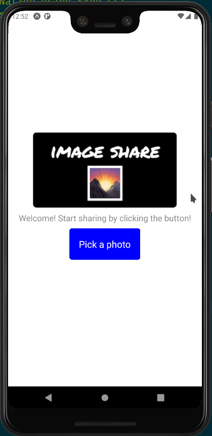

# Image Picker App

> Cross-platform app built with React Native using Expo CLI.
> Capture and share images with friends on iOS, android and web platform.

## Development

Use `yarn`, not `npm`

## Usage

- Fork/clone the repo.
- Install node module using:

```console
yarn
```

- Start the app:

```console
yarn start
```

## Demo


